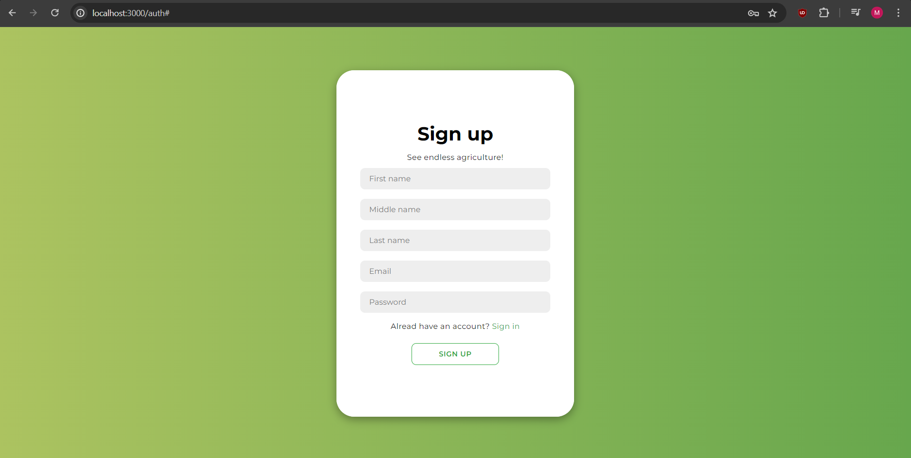
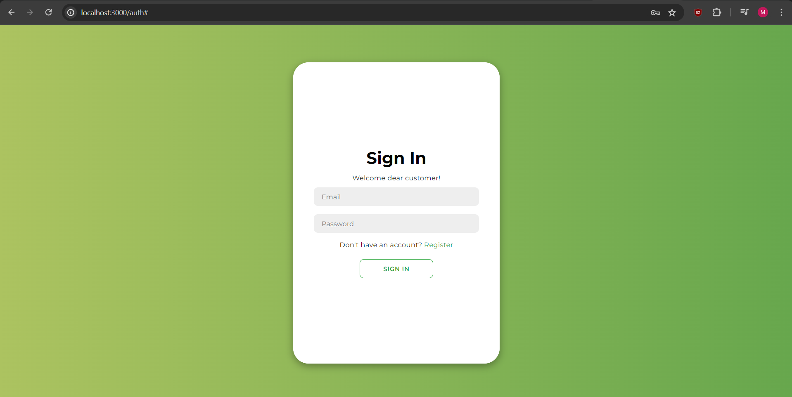
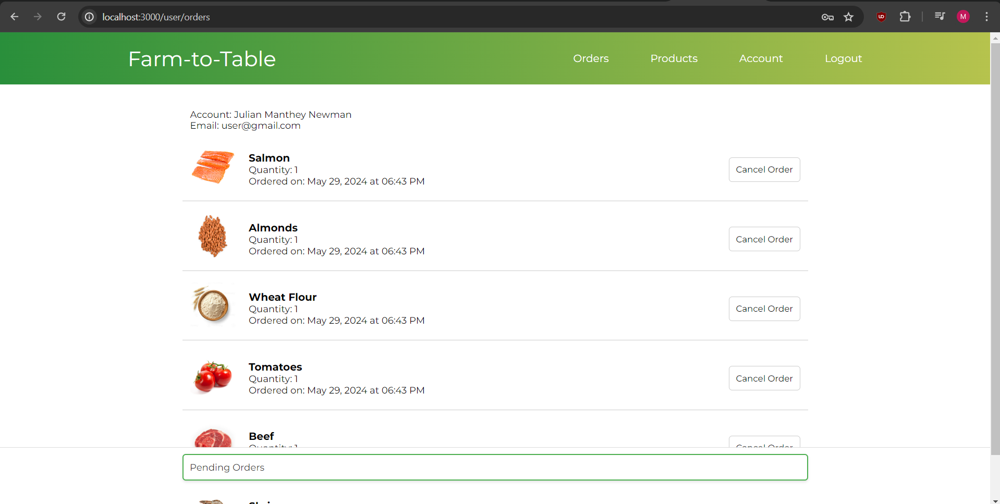
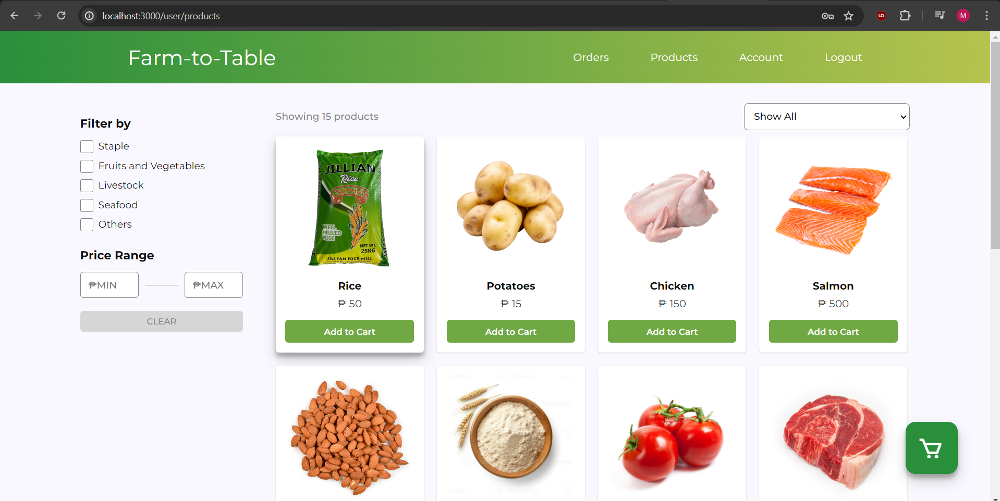
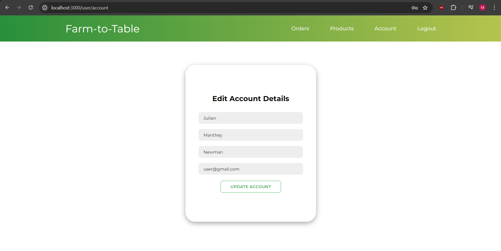
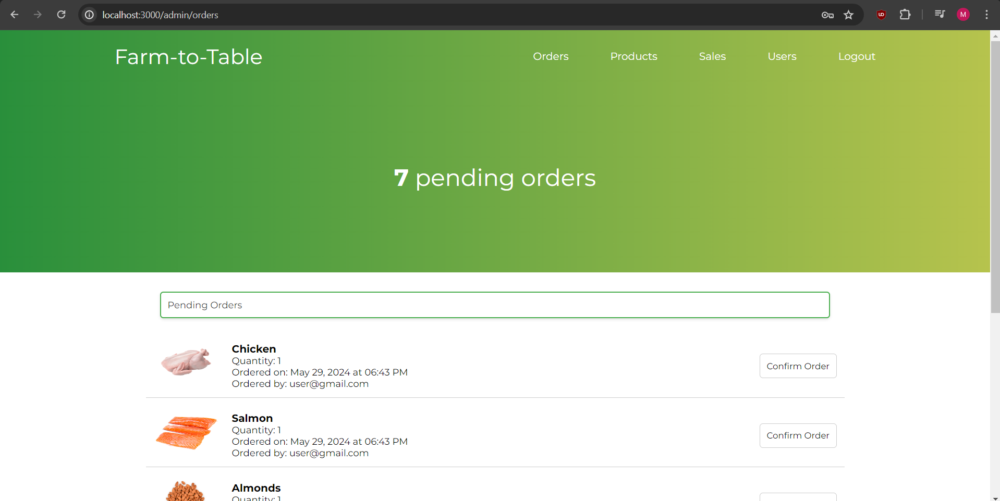
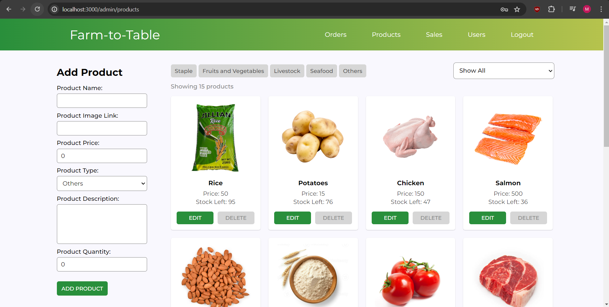
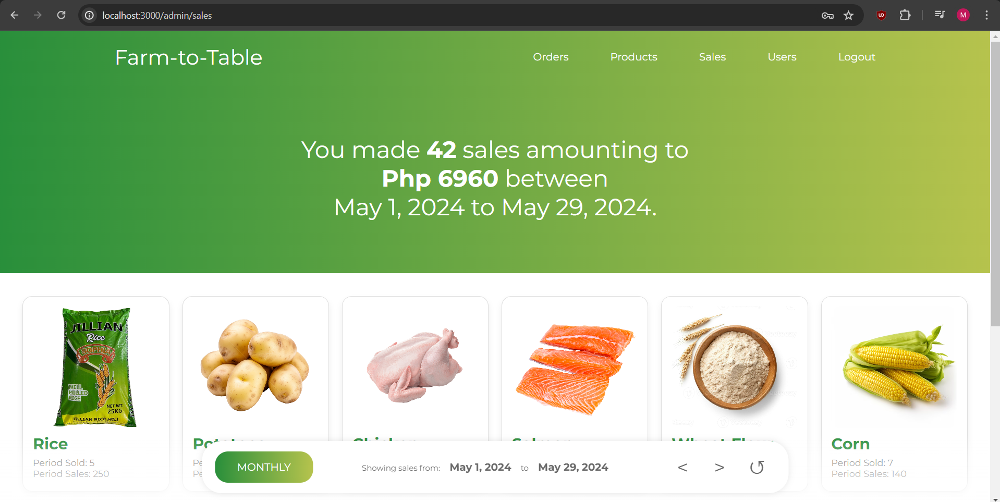
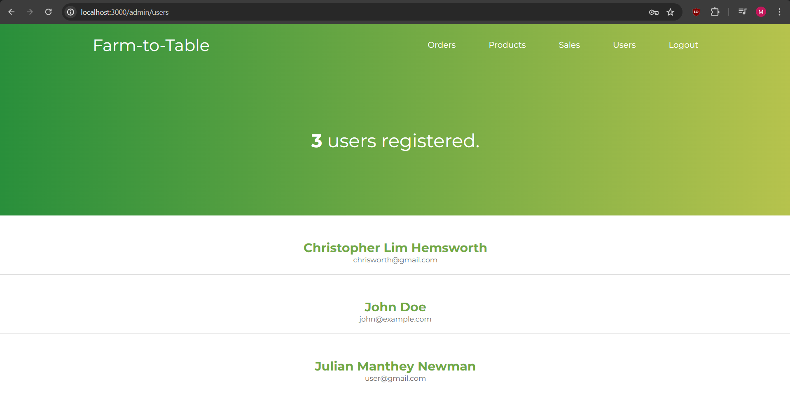

# CMSC 100 UV-4L PROJECT: FARM-TO-TABLE

**GROUP MEMBERS:**  
BALITAAN, AXEL  
CARIASO, MICHAEL URIEL D.  
MAISO, ZERINE DAPHNE  
MORELOS, FRANZ CHRISTIAN  

## PROJECT FEATURES

- User Authentication (Sign up/Sign in)
- User Authorization (Customer/Admin)
- E-commerce Management (Admin)
  - Management of User Accounts (View registered users)
  - Product Listing (Add, edit, remove products from the inventory)
  - Order Fulfillment (Confirm pending orders)
  - View Sales Report (Weekly, monthly, anually, all time)
- Shop (Customer)
  - Product Listing (Add, remove, and checkout products in the shopping cart)
  - Order Fulfillment (Cancel orders)
  - User Account (Edit account details)

## SAMPLE SCREENSHOTS

- Authentication

  - Sign up  
      
  - Sign in  
      

- Authorization

  - Customer View

    - user/orders
      
    - user/products
      
    - user/account
      

  - Admin View
    - admin/orders
      
    - admin/products
      
    - admin/sales
      
    - admin/users
      

## USAGE GUIDELINES

- Authentication and Authorization
  - A new user has to sign up by inputting their first name, middle name, last name, email, and password.
  - After signing up, the user will be redirected to the sign in page and sign in.
  - The user can have admin priveleges by signing up with the email "admin@da.gov.ph". Otherwise, the user will be signed in as customer
- Customer Features
  - http://localhost:3000/user/products
    - The customer can add the products displayed in the shop to the shopping cart by pressing the "Add to cart" button.
    - Products can be added, removed, and the quantity can be increased/reduced
    - The total price of the products in the shopping cart will be displayed and beside it is a checkout button the customer can press to order.
    - The products in the shop can be filtered by type (staple/fruits and vegetables/livestock/seafood/others)
    - The products in the shop can also be filtered by a price range (min, max)
    - The customer can also sort the product listing in ascending or descending order by product name and price
  - http://localhost:3000/user/orders
    - The customer can view their pending, completed, and canceled orders in the user/orders page
    - The customer can also cancel orders as long as it is not completed yet
  - http://localhost:3000/user/account
    - The customer can view and edit their details on the user/account page
  - The customer can press the "Logout" button at the upper right to sign out
- Admin Features
  - http://localhost:3000/admin/products
    - The admin can add a product in the inventory by filling out the fields in the admin/products page and pressing "ADD PRODUCT"
    - The products in the inventory can be edited by pressing the "EDIT" button inside each item and pressing "SAVE CHANGES" after editing the fields
    - The products can also be removed from the inventory by pressing the "DELETE" button inside a specific item
    - The admin can sort the products in ascending or descending order by name, price, or stock and filter the products by type
  - http://localhost:3000/admin/orders
    - The admin can view pending, completed, and canceled orders in the admin/orders page
    - The admin can also confirm pending orders, and once confirmed, the orders will be marked as completed on both the admin and customer side
  - http://localhost:3000/admin/sales
    - The admin can view the sales report in the admin/sales page
    - The admin can choose among four options: weekly, monthly, anual, and all time
    - The admin can click the "<" and ">" button for checking monthly sales
    - There is also a button the admin can click to refresh the data displayed
  - http://localhost:3000/admin/users
    - The admin can view the registered users and their order history in the admin/users page
  - The admin can press the "Logout" button at the upper right to sign out

## HOW TO RUN

- Clone the https://github.com/UPLB-CMSC100-AY2324-2S/cmsc100-ay2324-uv4l-ex08-michaelcariaso.git repository
- Open MongoDB Compass and connect to the URI mongodb://localhost:27017
- In Visual Studio Code, open a terminal (for backend) and navigate to the .\CMSC-100-Project\api directory
  - Type "npm install" in the terminal to download the needed modules
  - Type "node index.js" in the terminal to run the backend server
- In Visual Studio Code, open another terminal (for frontend) and navigate to the .\CMSC-100-Project\ directory
  - Type "npm install" in the terminal to download the needed modules
  - Type "npm run dev" in the terminal to run the frontend
  - Open http://localhost:3000/ in the browser
- Import .\CMSC-100-Project\sampleProducts.json to the products collection in the cmsc-100-project database (MongoDB Compass)
- Sign up and sign in using the "admin@da.gov.ph" to be authorized as admin
- Sign up and sign in using other email to be authorized as customer/user
